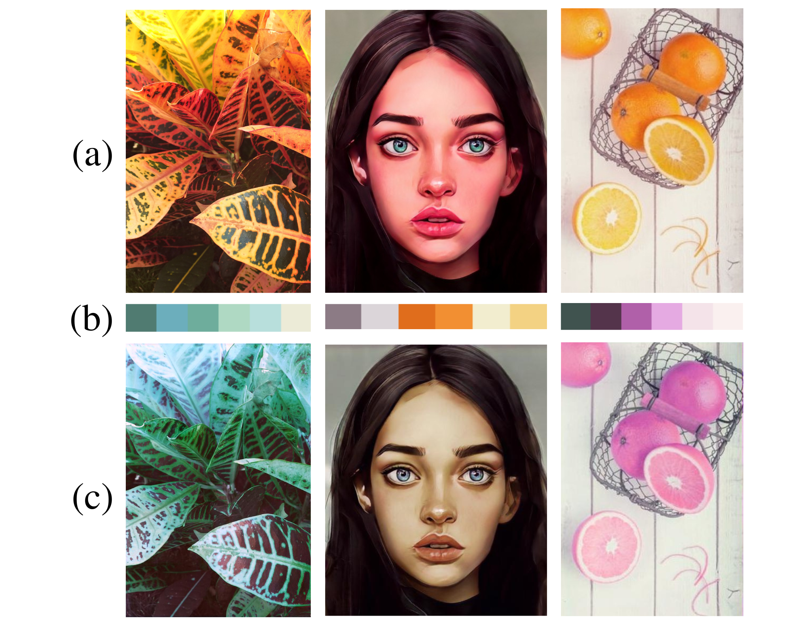

# Content Aware Image Recolorization
A deep neural network  which recolors an image according to a given target colour that is useful to express images in various colour concepts. The network is capable of
performing a content-aware recolorization based on the target palette. 

### Results

*a) The source image*

*b) The Target Palette*

*c) The recolorized image as per the target palette*

## Usage
Run __DL2022/run.py__ as

`python run.py -i 'path_to_input_image' -p 'hexcodes_of_color_palette' -m 'path_to_saved_model' -o 'path_of_output'`

Example

`python run.py -i 'Samples/3/3.png' -p '#507b71' '#6caebc' '#6ead9c' '#afd9c3' '#b8dfdc' '#ecebd7' -m 'saved_model/model.pth' -o 'output.jpg'`

## Refrence
[PaletteNet: Image Recolorization with Given Color Palette](https://openaccess.thecvf.com/content_cvpr_2017_workshops/w12/papers/Cho_PaletteNet_Image_Recolorization_CVPR_2017_paper.pdf)https://openaccess.thecvf.com/content_cvpr_2017_workshops/w12/papers/Cho_PaletteNet_Image_Recolorization_CVPR_2017_paper.pd)

